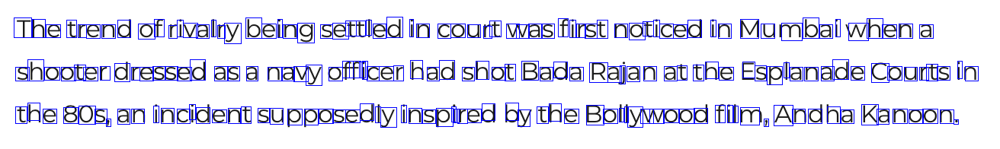
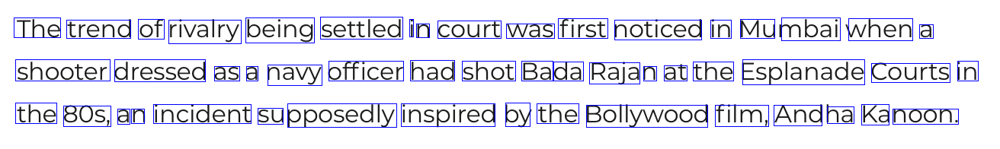

# JNocr Client
JNocr is a service to generate text from scanned images. It provides character, word and line level information in json format. 

This repository is a Python based client for JNocr.

## Releases

This is our initial release v 0.1, only English language is supported.

## Pre - Requisites

1. This client runs on Python 3.x.
2. **Optional:** For visualisation of bounding boxes, OpenCV.Python, V 3.x is required.

## Installation

- Download the repository as a zip file.

- Run Python setup.py install

## Usage

- Preliminary **ocr** in 1 line: ( after import)
``` 
from jnocr_client import do_ocr
```
 Assume *sample1.png* to be present in the "**samples**" directory

```
results = do_ocr("samples/sample1.png")
```
> Results as above is a python dictionary containing code, message, data and elapsed time.

***Viewing character info***:
```
for info in results["data"]["chars_info"]:
	print(info)
```


***Viewing word info***:
```
for info in results["data"]["words_info"]:
	print(info)
```

## Sample Output

The output will be in a dictionary format, each item represents a bounding box,text detected (character/word), confidence level, flag, flag confidence and character key(identifier for the character/word). 

The output also contains information about the elapsed time of each test image file.

### **Sample output for words info**:
```
{
   "box":[
      15,
      301,
      172,
      329
   ],
   "char_keys":[
      "char_0016_0305_0037_0330",
      "char_0037_0306_0054_0324",
      "char_0059_0305_0076_0323",
      "char_0076_0304_0097_0330",
      "char_0099_0305_0115_0324",
      "char_0115_0303_0128_0323",
      "char_0125_0306_0144_0324",
      "char_0147_0306_0158_0323",
      "char_0157_0305_0172_0324"
   ],
   "conf":0.922,
   "key":"word_0016_0303_0172_0330",
   "text":"gangsters"
} ,
# words information for second word
	{
	...
	}
.....
]
```

### **Sample output for character info**:
``` [
  # character information for first character
	 {
	   "box":[
	      613,
	      30,
	      636,
	      57
	   ],
	   "conf":1.0,
	   "flag":1,
	   "flag_conf":0.999,
	   "key":"char_0617_0031_0639_0057",
	   "text":"B"
	},
# character information for second character
	{
	...
	}
.....
]
```
## Sample Visualizations of Bounding boxes

1. ### Image with Character Bounding Boxes

2. ### Image with Word Bounding Boxes


## Examples

Please check out the "**examples**" folder for image samples.
